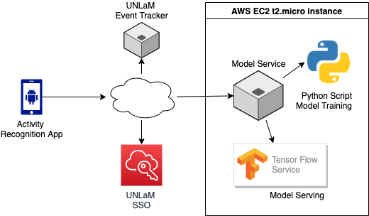

# Activity Recognition APP

El presente repo contiene el código fuente de un servicio web, scripts python y una mobile application 
que son parte de un sistema cuyo proposito principal es el de reconocer la actividad de los usuarios 
utilizando Machine Learning y datos de métricas recolectadas de los sensores de un dispositivo mobil.

## Arquitectura

### Detalle de módulos

#### SSO
Single Sign On provisto por La Cátedra de SOA. Se compone de un API REST con los servicios necesarios para registrar y hacer el login de los usuarios.

#### Event Tracker
Servicio provisto por La Catedra de SOA. Se compone de un API REST con los servicios necesarios para informar eventos de la APP.

#### Model Service
Servicio REST que permite crear, entrenar, resetear (usado para reentrenar) y eliminar modelos asi como tambien expone un endpoint para realizar las inferencias.
Se encuentra desarrollada en Java usando Spring Boot.

#### Scripts Python
Utilizados para entrenar el modelo y en la etapa de modeling y tuning. 
El script de training (train.py) recibe un path donde debe ir a buscar los datos de los sensores 
recolectados por la APP android y otro path donde debe escribir el modelo entrenado. Este sera luego 
usado en la fase de predicción.
El script train.py es invocado por el Model Service cuando el modelo ha finalizado su fase de 
recolección de datos y debe comenzar el training.

#### Tensorflow Serving https://www.tensorflow.org/tfx/guide/serving
Este servicio (de terceros) es utilizado para el servido del modelo. 
Expone un API REST para realizar las predicciones. Sólo se le debe proporcionar el path donde se 
encuentran los modelos a servir. Admite cambios y re-deploys de los modelos sin requerir reinicio 
del servicio lo cual lo hizo adecuado para el proyecto. 

### Modo de uso de la APP

#### Login / Registro
No mucho que aclarar, los pasos normales de una autenticación básica.

#### Menu Principal
El menu principal muestra los siguientes botones:
* *Logout*. Realiza el logout de la APP. 
* *Resetear el Modelo*. Borra el modelo actual y lo crea nuevamente. 
* *Captura Usuario 1*. Ingresa a la sección de captura de datos de sensor para el usuario 1. 
Envia datos de los sensores al Model Server. El sensor listener empaqueta (y promedia) generando 
paquetes de 50 mediciones de 4 sensores cada segundo (3 coordenadas cada sensor, hacen 12 valores por medicion). 
Enviando paquetes vectoriales de 50x12 valores.   
* *Captura Usuario 2*. Idem para el usuario 2.
* *Entrenar el modelo*. Envía un mensaje al Model Service para que realice la invocación al Python 
script train.py y aguarda a su finalización. El modelo suele entrenar en ~1 minuto, pero el reload 
del modelo en el Tensorflow Service suele demorar hasta un minuto más. Con lo cual este proceso 
demora unos 2 minutos aproximadamente.
* *Predicción de usuario*. En esta sección el usuario podrá realizar acciones y la app indicara su 
predicción sobre quién de los dos usuario, el 1 o el 2, es el que está realizándola. 
Para esto, envía peticiones al Model Service que a su vez las delega en el Tensorflow Service. 
La captura de datos de los sensores se realiza de manera similar a la de la fase de captua, 
enviando paquetes de 50x12 una vez cada segundo.

### Consideraciones sobre el modelo

El modelo usado es una red neuronal de tipo RNN (Recursive Neural Network). Concretamente una red 
con una capa de LSTM (Long Short Term Memory) a la que se le entrena con inputs o tensores de (N, 50, 12),
done N es la cantidad de entradas, tipicamente 120 ya que es una por segundo, con 60 segundos por usuario, son las 
120. Es decir, con una sequencia temporal de mediciones correspondiente a 1 segundo de actividad de 
cada usuario. 
El target que se le indica al modelo para el training para cada entrada es 0 o 1 indicando Usuario 
1 o 2 respectivamente. El modelo y las pruebas realizadas se puede ver [aquí](/CODIGO/models/modeling.ipynb). 

### Conclusiones
* Los resultados obtenidos son aceptables. El modelo logró predecir con bastante certeza diferentes actividades y usuarios.
* Algo destacable es que no es requerido que el Usuario 1 sea una persona y Usuario 2 una diferente. En realidad, el modelo intenta reconocer patrones de actividad de 
los sensores, asi que puede usarse para realizar HAR (Human Activity Recognition). 
Por ejemplo, se puede caminar durante todo la captura de Usuario 1, y quedarse quieto o correr durante la del Usuario 2. 
Luego en fase de inferencia, el modelo reconocerá (con cierto nivel de certeza) la actividad que esta haciendo el usuario en ese momento. 
* La clasificacián en este caso es binaria. No obstante se podria extender a una clasificaciones de N clases como trabajo futuro.
* Todo el trabajo de infrastructura, integración de los servicios y las app insumió mucho tiempo de modo que 
se dedicó poco tiempo al tuning del modelo. Incluso no se pudo probar otros tipos de modelos de ML. Queda para trabajo futuro encarar esto.
* Se intento sin exito servir el modelo local dentro de la app. Se intento implementar tensorflow lite
lo cual hubiera sido un fit natural, pero actualmente no soporta LSTM networks. Lo tienen como roadmap para el 2020.
* Se penso también en servir el modelo desde el Model Service. Se probo con deeplearning4j sin exito. Se encontro poca documentación. 
Tensorflow serving resolvio el requerimiento con muy baja latencia ademas, ya que esta desarrollado en c++ usando directamente 
la lib de tensorflow desarrollada en el mismo lenguaje. 

